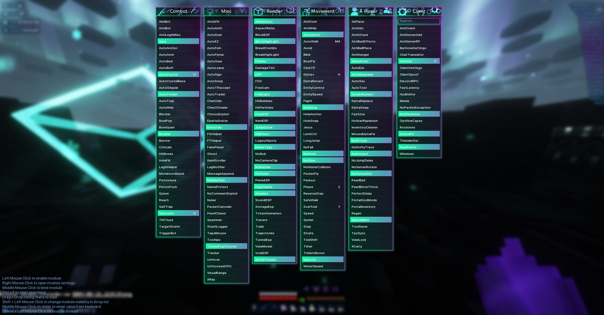
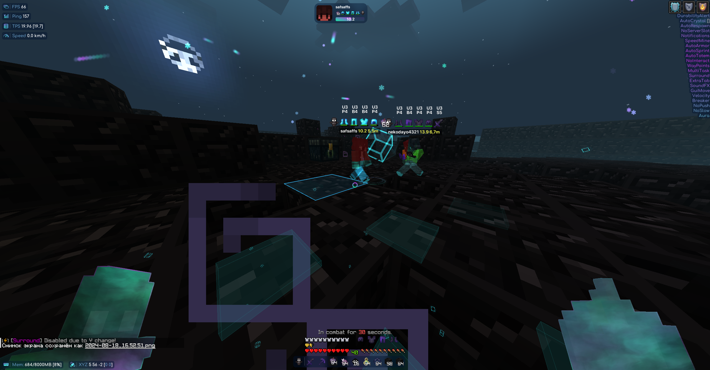
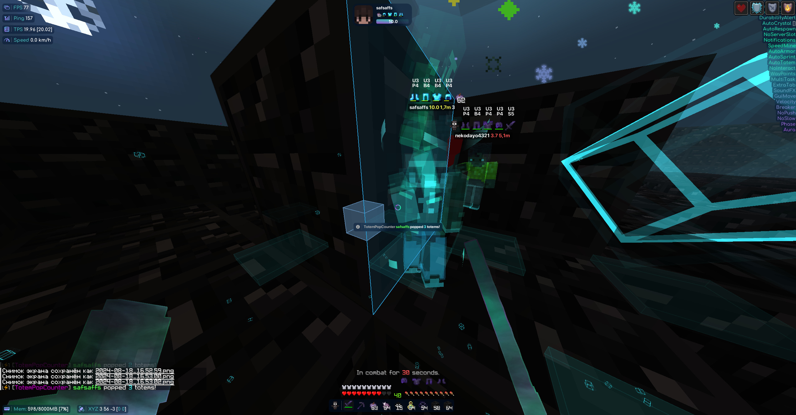

<p align="center">
    
</p>

> [!WARNING]
> Work on ThunderHack Recode is completely stopped, 
> it will be replaced by CatLean, a new free client
> with closed source code and higher quality modules,
> you can follow CatLean in my [Discord server](https://discord.gg/PvBhPWdkVD)

<div align="center">

</div>


<div align="center">

[](https://discord.gg/PvBhPWdkVD)

</div>


# Cya 04.04.23 - 9.10.24 project!
<div align="center">

</div>

## Information

- Minecraft version: ```Fabric``` 1.21 (or whatever version's the latest)
- Default ClickGui keybind - **```P```** (<--- it is not, you should go to the Discord server and ask for the real keybind)
- Default prefix - **```@```**
- Middle click the module to bind it.
- Be aware Expensive, DoxWare 2.0, gumballoff, Treoderia "Recode", Deluxe Client, and Quick Client are both ratted and renames of this client.

## Requires these mods:

- [FabricApi 1.21](https://www.curseforge.com/minecraft/mc-mods/fabric-api/files/5531908)
- [Java 21+](https://www.oracle.com/java/technologies/javase/jdk21-archive-downloads.html)

## Recommended to read:

- [Performance guide for Minecraft 1.20.4+ Clients](https://gist.github.com/HexedHero/aab340a84db51913cb1106c2d85f4e4f)
- [Setup guide by @DevilishRak](https://thunderguidemc.vercel.app/)

## Credits

- [Ai_24](https://www.youtube.com/@Ai_24) for cool showcase
- [KiLAB Gaming](https://www.youtube.com/@KiLABGaming) for complete overview
- [@meteordevelopment](https://github.com/meteordevelopment) for orbit
- [@ladysnake](https://github.com/ladysnake) for satin
- [@0x3C50](https://github.com/0x3C50/Renderer) for the renderer

## Screenshots
<details>
<summary>GUI</summary>


</details>
<details>
<summary>CRYSTAL HVH</summary>




</details>
<details>
<summary>SWORD HVH</summary>


</details>


## Addons

### Resources

- [Addon Template](https://github.com/cvs0/ThunderHack-Recode-Addon-Template) by cvs0
- [ThunderHack Addon Docs (COMING SOON)]()
